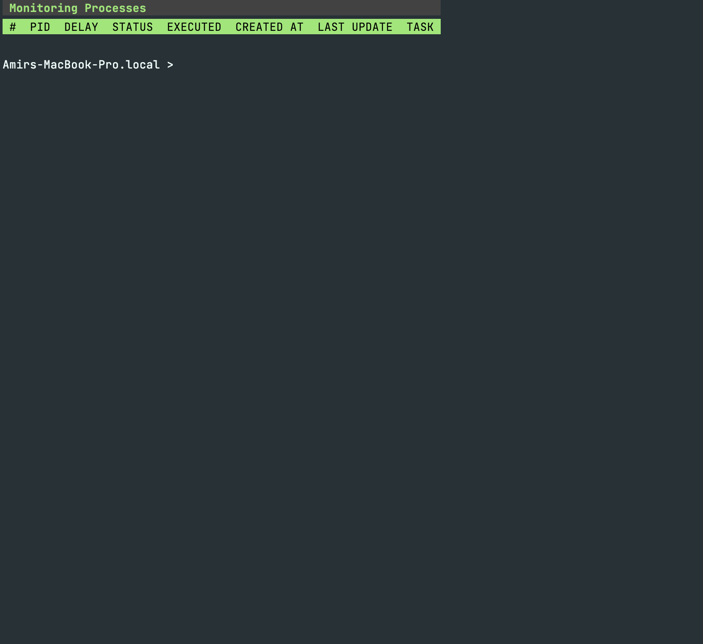
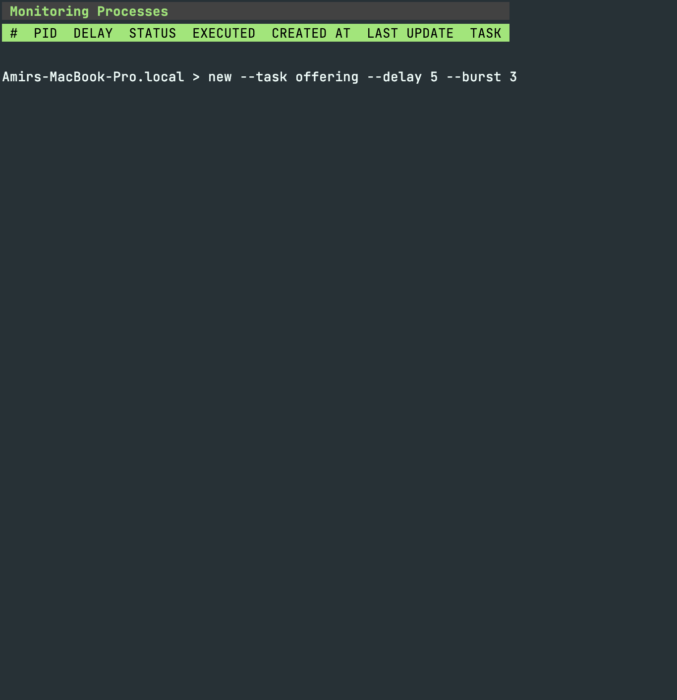
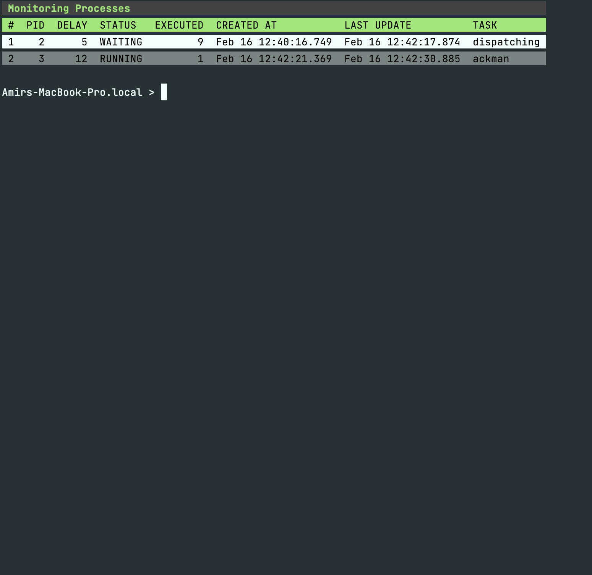
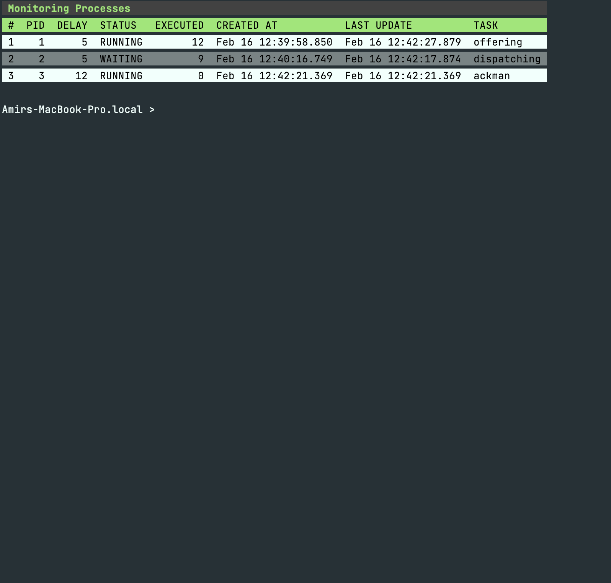
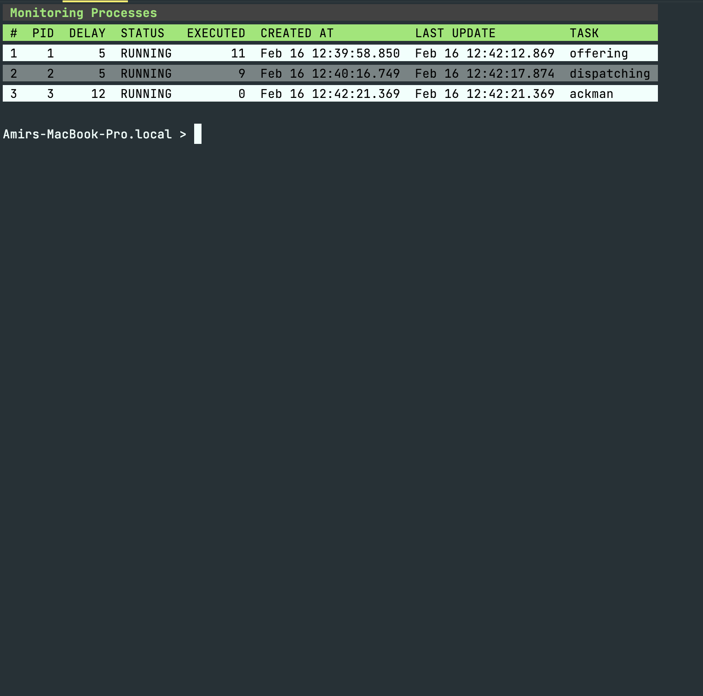

<h1 align="center">
Process Manager
</h1>

Manage and monitor operating system process with Golang. This
project is like a simulator for operating system cpu. Process Manager allows you to simulate the CPU process
managing. It allows you to monitor the processes and perform
operations on them.

## How to use this project ?
After cloning into the project:
```shell
git clone https://github.com/amirhnajafiz/process-monitoring.git
cd process-monitoring
```

By default, you can create upto 10 processes, but you can customize the limit
by setting the limit variable with following command:
```shell
go run main.go limit[optional]
```

<p align="center">
    
</p>

The following commands are supported for this application:
### New Process
```shell
new --task [task name] --delay [task delay] --burst [overhead time of process]
```

<p align="center">
    
</p>

### Kill Process
```shell
kill --id [task PID]
```

<p align="center">
    
</p>

### Stop a process
```shell
pause --id [task PID]
```

<p align="center">
    
</p>

### Start a process
```shell
run --id [task PID]
```

<p align="center">
    
</p>

### Exit
```shell
terminate
```
